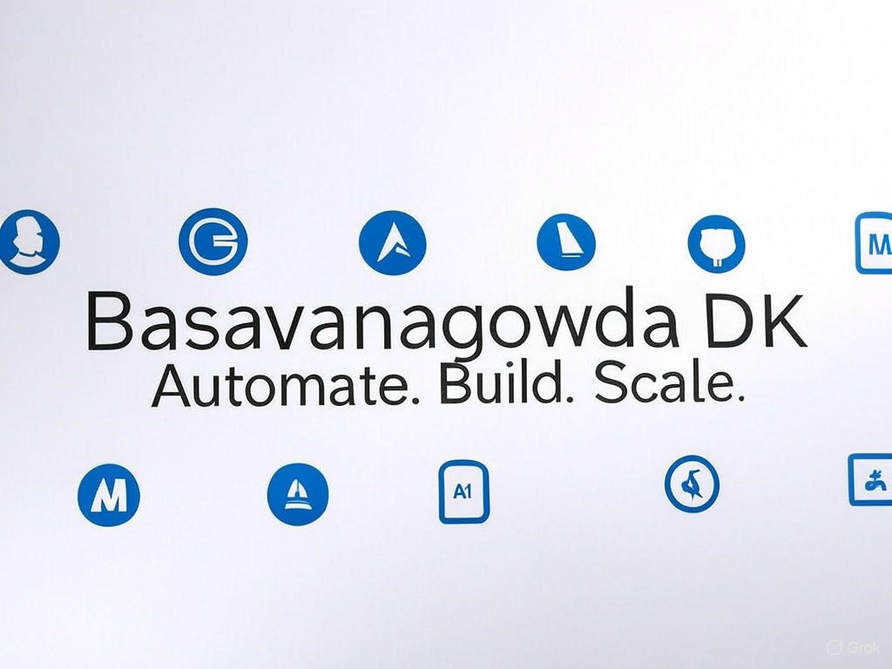

# Hi, I'm Basavanagowda DK 👋

🚀 **Full Stack Developer | Moodle Specialist | Cloud Enthusiast**

I'm a developer who builds smart solutions — not just software.  
With 3 years of experience in **Moodle customization**, **plugin development**, and **full stack web development**, I specialize in **streamlining workflows** through **AI-driven automation**, **cloud infrastructure deployments** (Azure, AWS), and **DevOps scripting**.

I believe coding should be about leverage: less grunt work, more impact.

---

## 🔥 What I Do Best

- **Backend:** PHP, Java, Moodle API, Custom Plugin Development
- **Frontend:** HTML5, CSS3, JavaScript, jQuery, Bootstrap 5
- **Cloud & DevOps:** Microsoft Azure (AZ-104 Certified), AWS, Apache, Nginx, Shell Scripting, CI/CD Pipelines.
- **Version Control:** Git, GitHub, Bitbucket
- **Database:** MySQL
- **Project Management:** Agile, JIRA
- **AI Tools:** GitHub Copilot, Cursor (Agent Mode), ChatGPT, Grok

---

## 🛠️ Projects & Contributions

- **AI Automation Tools** — Automating Bootstrap 4 ➔ Bootstrap 5 migrations for Moodle plugins to save hours of manual effort.  
  👉 [Check it out](https://github.com/BASAVANAGOWDADK/ai-automation-tools)

*(More coming soon...)*

---

## 🏆 Awards & Achievements

- **Product Catalyst Award** (Sep 2024) – *Recognized for Driving Innovation Forward*
- **Best Employee of the Month** – *May 2023 and March 2024*
- **Best Team of the Year** (2022-2023) – *Top-Performing Team Award*

---

## 📈 Professional Experience

**Full Stack Developer — Succeed Technologies Pvt. Ltd., Bangalore**  
*(Aug 2022 – Present)*

- Upgraded multiple Moodle instances to 5.x with plugin/theme compatibility.
- Automated plugin migrations and debugging using AI tools.
- Developed, deployed, and optimized Moodle-based eLearning platforms.
- Created custom DevOps scripts and AWS automation workflows.
- Led sprint planning and Agile execution via JIRA.
- Configured scalable server environments (SSL, virtual hosts, optimization).

---

## 📬 Let's Connect

- [LinkedIn](https://www.linkedin.com/in/basavanagowda-d-k-b6b56a1a2/)
- [Email](mailto:basavanagowdadk@gmail.com)
- [Outlook](mailto:basavanagowdadk@outlook.com)

---

> **"Don't automate to save time. Automate to build bigger things."** 🚀
