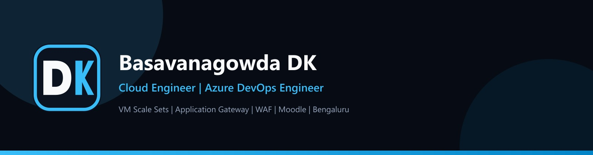

# Basavanagowda DK

**Cloud Engineer | Azure DevOps Engineer** · Bengaluru

Senior Software Engineer at Succeed Technologies since August 2022. I support Azure-hosted Moodle and PHP platforms in production: virtual machines, VM Scale Sets, Application Gateway, WAF, Redis, Azure MySQL Flexible Server, and shared file storage. Releases go out with GitHub Actions and Docker.

Open to full-time Cloud Engineer, Azure DevOps Engineer, and Cloud + Moodle roles.

## Proof

- Contributed to an **80%** reduction in related Azure Application Gateway and WAF cost, with no planned service interruption
- **3-year** Azure reservations for production VMs and MySQL Flexible Server, about **52%** lower than pay-as-you-go
- About **50–60** production and client issues resolved
- VM Scale Set autoscaling in production for Elearnposh and Omega

## What I use in production

**Azure:** Virtual Machines, VM Scale Sets, autoscale, Application Gateway, WAF, Redis, Azure MySQL Flexible Server, Azure NetApp Files, File Storage, SSL, backup, cross-region recovery, reservations

**Delivery:** GitHub Actions, Docker, CI/CD, Git, Linux, Apache, Nginx, monitoring, incident response, runbooks

**Application:** Moodle LMS, PHP, JavaScript, MySQL, REST APIs, SCORM, multi-tenant LMS

## Selected work

**High-availability Azure — Elearnposh and Omega**  
VM Scale Set autoscaling with Application Gateway, WAF, Redis, managed MySQL, and shared file storage.

**Azure WAF and Application Gateway consolidation**  
Moved multiple sites, domains, and certificates onto one multi-site gateway. Contributed to an 80% reduction in related infrastructure cost. Level 2 Employee of the Month, June 2025.

**Moodle performance and releases**  
Tuned reports, courses, and user listings. GitHub Actions and Docker across development, staging, and production. Tested backup and cross-region recovery.

**SCORMBridge**  
Contributed to secure SCORM delivery on Moodle. Product Catalyst Award, September 2024.

## Awards

- June 2025 — Level 2 Employee of the Month, Azure WAF and Application Gateway cost optimization
- September 2024 — Product Catalyst Award, SCORMBridge
- March 2024 and May 2023 — Employee of the Month
- 2022–2023 — Best Team of the Year, Team of Stars

## Training and education

- May 2024 — Microsoft Azure Administrator (AZ-104) training, Besant Technologies. Training only, not a Microsoft certification.
- June 2022 — Full-Stack Web Development and Software Testing, QSpiders
- 2016–2020 — B.E. Mechanical Engineering, STJIT College of Engineering, Karnataka

## Contact

- [Portfolio](https://basavanagowdadk.github.io/Portfolio/)
- [Resume](https://basavanagowdadk.github.io/Portfolio/Basavanagowda_DK_Resume.pdf)
- [LinkedIn](https://www.linkedin.com/in/basavanagowda-d-k-b6b56a1a2)
- [Email](mailto:basavanagowdadk@gmail.com)
