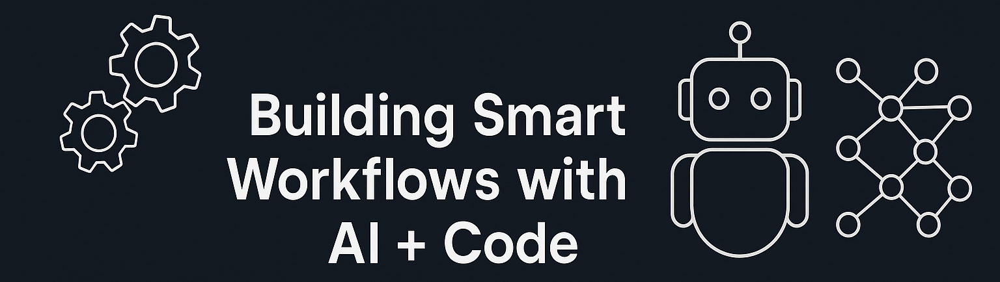

# 👋 Hi, I'm Basavanagowda DK

🚀 **DevOps Engineer | Full Stack Developer | Moodle LMS Specialist | Azure & AWS Certified**

I help companies scale their learning platforms and automation pipelines — faster, cheaper, and with fewer headaches.

With 3+ years of experience building **custom Moodle LMS**, deploying **CI/CD pipelines**, and optimizing **cloud infrastructure**, I specialize in reducing complexity and delivering scalable, secure, and cost-effective solutions.

---

## 💼 Who I Help

✅ **Product teams** building LMS or internal learning platforms  
✅ **Startups** needing end-to-end CI/CD pipelines and DevOps scripting  
✅ **Organizations** looking to cut Azure/AWS infra costs without breaking features

---

## ⚙️ Tech Stack & Tools

**Languages & Backend:** PHP, Java, JavaScript (ES6+), Moodle API, REST  
**Frontend:** HTML5, CSS3, Bootstrap 5, jQuery  
**DevOps & Cloud:** Azure (AZ-104), AWS (EC2, S3, IAM), Jenkins, Docker, GitHub Actions, Terraform  
**Infra & Web Servers:** Apache, Nginx, Shell scripting, SSL, VM provisioning  
**Databases:** MySQL, PostgreSQL  
**Automation/AI Tools:** GitHub Copilot, ChatGPT, Cursor, Grok  
**Project Management:** Git, Bitbucket, JIRA, Agile/Scrum

---

## 📈 Highlight Projects

### 🔹 CI/CD Infrastructure for Moodle-Based LMS
- Built pipeline with Jenkins, Docker, GitHub Actions  
- Terraform-based infra-as-code deployment (Azure & AWS)  
- ✅ *Reduced release time by 60% and improved reliability*

### 🔹 Azure WAF Cost Optimization
- Re-architected Azure infra from multiple gateways into a single multi-site gateway  
- ✅ *Cut cloud infra costs by 80%, zero downtime during migration*

### 🔹 [AI Automation Tools](https://github.com/BASAVANAGOWDADK/ai-automation-tools)
- Shell-based tool for auto-converting Moodle Bootstrap 4 ➝ 5  
- ✅ *Saved 10+ hours per plugin upgrade for developers*

---

## 🏆 Awards & Recognition

- 🏅 **Product Catalyst Award** – *For SCORMBridge innovation* (Sep 2024)  
- 🧠 **Employee of the Month** – *March 2024, May 2023*  
- 💎 **Best Team of the Year** – *2022–2023 Engineering Team Award*  
- 🔥 **Level 2 EOM** – *Reduced Azure cost by 80% (June 2025)*

---

## 📚 Certifications

- **AZ-104: Microsoft Azure Administrator**  
  VM provisioning, RBAC, AD, networking, infra monitoring

- **Full-Stack Development & Testing (QSpiders)**  
  HTML/CSS/JS, Core Java, Selenium, TestNG, JIRA Agile

---

## 🧠 What I Believe

> **“Don’t automate to save time. Automate to build bigger things.”**  
> – That’s how I approach every project — with leverage, speed, and simplicity.

---

## 🌐 Let's Connect

- 🔗 [LinkedIn](https://www.linkedin.com/in/basavanagowda-d-k-b6b56a1a2)  
- 💼 [Portfolio](https://www.basavanagowdadk.work)  
- 📧 [Email](mailto:basavanagowdadk@gmail.com)  
- 📁 [Resume](https://drive.google.com/file/d/10zbf5kDK9-Rex3izi6hGcO_l19ps5BTh/view?usp=sharing)

---

## 🔍 What’s Next?

I’m actively open to:
- 📬 Freelance or consulting in Moodle, DevOps, CI/CD, Cloud
- 🤝 Collaborations with product teams or startups
- 💻 Full-time roles focused on automation, scalability, and developer tooling

Let’s connect and build smarter systems together.
